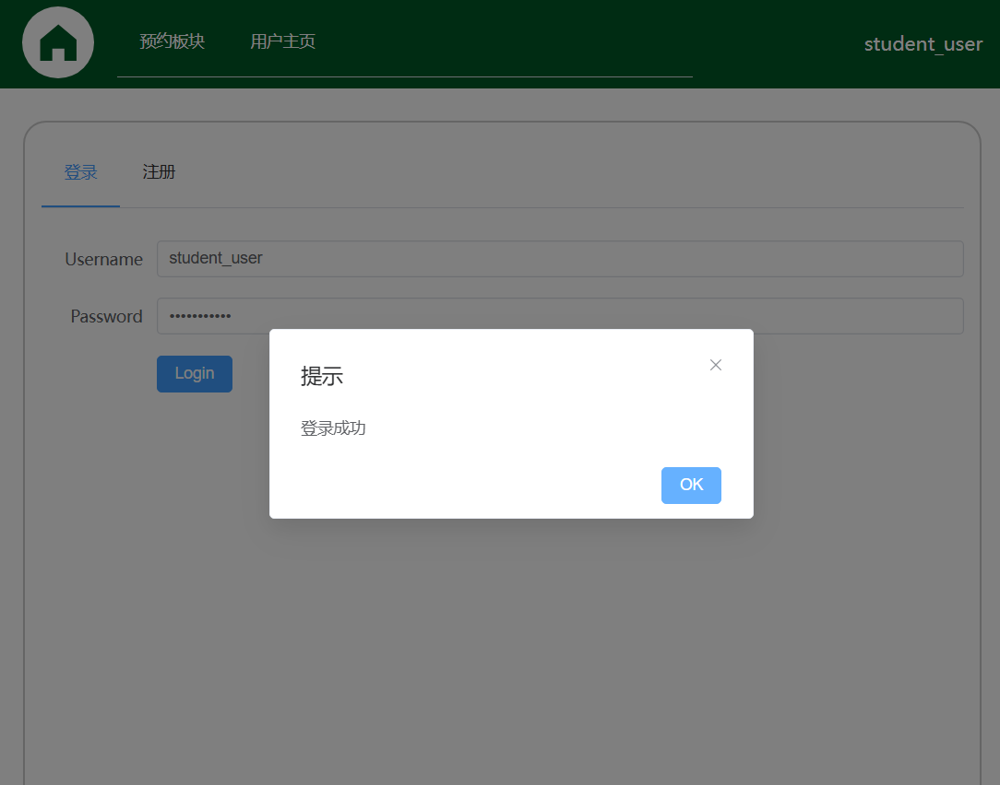
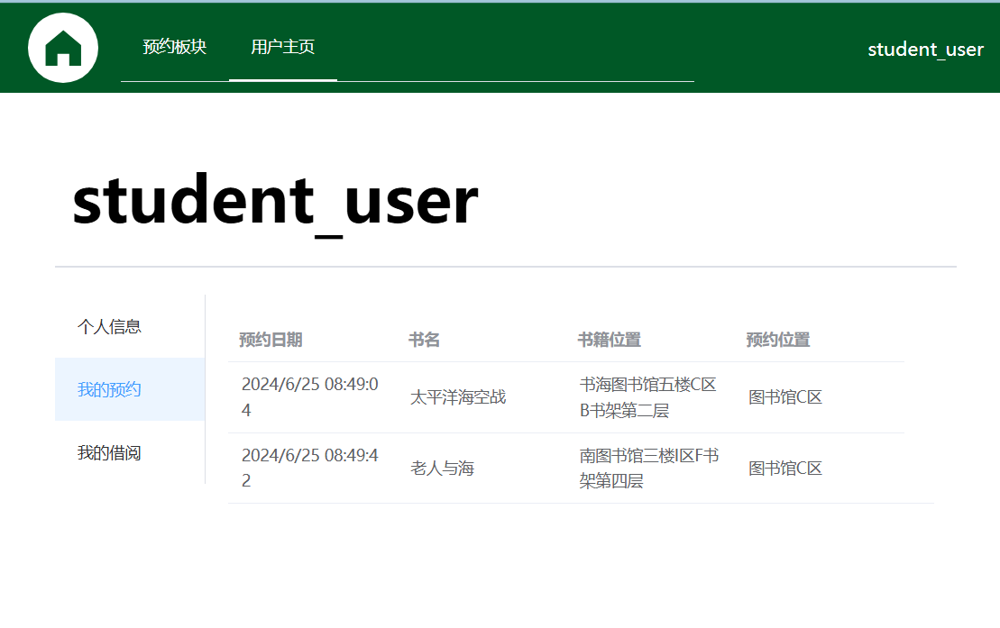

# 图书预约管理系统客户端

> 该部分是图书预约管理系统的客户端，实现了用户注册、登录、图书检索、评论、预约的界面和交互等功能。

## 一、功能展示

- 用户登录



- 图书检索


- 图书评价


- 图书预约




## 二、如何运行

1. 进入`client`目录，安装项目依赖

```sh
npm install
```

2. 开发阶段进行编译和热重载(Hot-Reload)，运行以下命令，然后在浏览器打开网址

```sh
npm run dev
```

3. 生产环境进行类型检查(Type-Check)、编译和压缩(Minify)

```sh
npm run build
```

4. 部署到本地服务器

```sh
npm install -g http-server
cd dist
http-server
```

5. 在浏览器打开网址，一般是`http://127.0.0.1:8080`


## 三、开发环境、版本和技术栈

- 推荐IDE: [VSCode](https://code.visualstudio.com/) + [Volar](https://marketplace.visualstudio.com/items?itemName=Vue.volar)

- JavaScript版本标准: ES6

- Typescript: 需要[Volar](https://marketplace.visualstudio.com/items?itemName=Vue.volar) 进行对`.vue`文件的类型检查

- node:20.12.5

- vue:3.4.21

- vue-router:4.3.0

- pinia:2.1.7

- element-plus:2.7.5

- vites:1.6.0

- happy-dom:14.12.3

- axios:1.7.2

- 详见`package.json`
## 四、目录结构

```
│  App.vue
│  main.ts 
│  
├─assets 
│          
├─components # vue组件
│  │  AppFooter.vue # 底部
│  │  AppHeader.vue # 头部
│  │  Logo.vue
│  │  ReservationComfirm.vue # 预约
│  │  
│  ├─Admin # 管理员相关组件(TODO)
│  │      ActivityManage.vue
│  │      BookManage.vue
│  │      UserManage.vue
│  │      
│  ├─Detail # 书籍详情页相关组件
│  │      CommentInput.vue # 输入评论、打分
│  │      CommentList.vue # 评论列表
│  │      Detail.vue # 详情页显示
│  │      
│  ├─Home # 首页相关组件
│  │      ActivityCard.vue # 活动(TODO)
│  │      Book.vue # 图书信息
│  │      BookBrowser.vue # 图书浏览
│  │      ReserveList.vue # 预约列表
│  │      Search.vue # 搜索
│  │      
│  ├─Login # 登录/注册界面组件
│  │      Login.vue
│  │      Register.vue
│  │      
│  ├─Profile # 用户配置
│  │      Borrowed.vue # 已借阅图书
│  │      General.vue # 其他信息
│  │      Reservations.vue # 预约信息
│  │      
│  └─Reserve # 预约组件
│          ReservationCard.vue
│          
├─router # 页面间路由
│      index.ts
│      
├─service # 和后端服务交互的API
│      activity.ts
│      api.ts
│      base.ts
│      book.ts
│      comment.ts
│      reservation.ts
│      user.ts
│      
├─store # 管理应用状态
│      index.ts
│      
├─tests # 测试相关文件
│  │  setup.ts
│  │  
│  ├─mock 模拟数据
│  │          
│  └─unit 单元测试
│              
├─types # 定义数据类型
│      index.ts
│      
└─views # 外观视图
        AboutView.vue #关于(TODO)
        AdminView.vue #管理员
        DetailView.vue #详情页
        HomeView.vue #主页
        LoginView.vue #登录
        ProfileView.vue #用户配置
        ReserveView.vue #预约
        SearchView.vue #搜索(TODO)
```


## 五、其他

提交代码前，请先执行以下命令，格式化代码

```sh
npm run prettier
```

